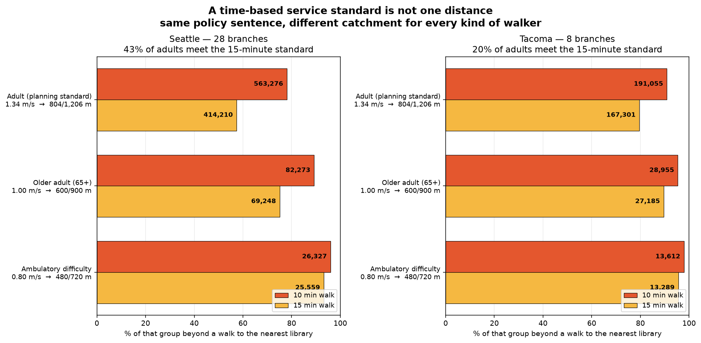

# Civic Coverage Lab

Walking access to civic amenities, measured properly: real street networks, real terrain,
and separate walker profiles — then benchmarked against classical facility-location
optimisation to see whether the topology the project started from actually helps.

Case studies: libraries in Seattle (28 branches), Tacoma (8) and Phoenix (17); parks in
Seattle (254) and Tacoma (66). Narrative version: **[WRITEUP.md](WRITEUP.md)**.

```bash
uv run python -m ccl.build seattle tacoma phoenix         # libraries (default)
uv run python -m ccl.report seattle tacoma phoenix        # 8-page PDF per city

uv run python -m ccl.build parks seattle tacoma           # a different amenity
uv run python -m ccl.report parks seattle tacoma
```

Sample output, from the latest release: [Seattle](https://github.com/johneatmon/civic-coverage-lab/releases/latest/download/report_seattle.pdf) ·
[Tacoma](https://github.com/johneatmon/civic-coverage-lab/releases/latest/download/report_tacoma.pdf) · [Phoenix](https://github.com/johneatmon/civic-coverage-lab/releases/latest/download/report_phoenix.pdf)

---

# Current results

Everything in this section is re-derived from the current build by
[`scripts/verify_readme.py`](scripts/verify_readme.py). The phase log further down is a
**changelog** — its numbers are as-of the phase that produced them and several have since
been superseded. Where the two disagree, this section is right.

> **Data provenance.** Figures were produced on **2026-08-17**. Sources differ in how
> stable they are, which is what determines whether a rebuild reproduces them:
>
> | source | used for | vintage |
> |---|---|---|
> | US Census ACS 5-year | population, age, poverty, vehicle access, ambulatory difficulty | **2023 release — fixed** |
> | US Census TIGER | block group / tract geometry, water | **2023 release — fixed** |
> | USGS 3DEP | elevation | accessed 2026-08-17; revised infrequently |
> | Municipal open data | branch locations | accessed 2026-08-17 |
> | OpenStreetMap | walk network, land use | accessed 2026-08-17 — **live and mutable** |
>
> The Census inputs are versioned releases and will reproduce exactly. OpenStreetMap is
> edited continuously, so rebuilding shifts these numbers by roughly a point or two — a
> rebuild on 2026-08-18 moved 15 of 93 README figures, none by more than 2% except one
> percentile over 30 draws. Pinning it is not practical: the three walk graphs are 517 MB,
> which is Git LFS territory for data that is fully re-derivable. The verifier scripts
> therefore check the documents against *whatever build is on disk*, so after a rebuild
> expect a few mismatches and regenerate rather than hunt a bug.

## Access

| | Seattle | Tacoma | Phoenix |
|---|---:|---:|---:|
| library branches | 28 | 8 | 17 |
| residents analysed | 721,942 | 210,290 | 1,522,291 |
| residents per branch | 25,784 | 26,286 | **89,547** |
| median walk to a branch | 19 min | 26 min | **53 min** |
| adults beyond a 15-min walk | 57.5% | 79.5% | **95.0%** |
| 65+ beyond a 15-min walk | 75.0% | 89.5% | 97.4% |
| ambulatory difficulty beyond a 15-min walk | **93.2%** | **95.4%** | **98.5%** |

## How you measure changes the answer

Same city, same branches, each rung measured more carefully. Rungs 1–3 hold the population
fixed; rung 4 changes both the model and the population it applies to.

| rung | Seattle | Tacoma | Phoenix |
|---|---:|---:|---:|
| 1. straight-line radius, 1,206 m | 35.8% | 62.5% | 89.9% |
| 2. + street network | 55.4% (+19.7) | 79.2% (+16.7) | 95.0% (+5.1) |
| 3. + terrain | 57.5% (+1.9) | 79.5% (+0.4) | 95.0% (+0.0) |
| 4. + mobility profile | 93.2% | 95.4% | 98.5% |
| **straight-line understates by** | **21.7 pts / 155,907** | 17.0 pts / 35,775 | 5.2 pts / 78,795 |

The network step is large everywhere, including flat gridded Phoenix — a grid forces
Manhattan travel at ~1.3× straight-line regardless of terrain. Median detour ratio:
Seattle 1.32, Tacoma 1.35, Phoenix 1.35.

## Terrain, and who pays for it

| | Seattle | Tacoma | Phoenix |
|---|---:|---:|---:|
| walk segments steeper than the 5% accessible-route grade | 24.6% | 14.4% | 1.9% |
| residents with no route to a branch within a 5% grade | **12,484** (46%) | 3,087 (22%) | 1,063 (1.3%) |

Adding terrain moves the adult figure ~2 points and the ambulatory-difficulty figure ~13.
Nearly the whole cost of topography falls on one group. The no-route count is
threshold-sensitive (1,057–19,775 across 4–15% cutoffs in Seattle) and should not be quoted
alone; under a graded penalty instead of a cutoff nobody is stranded, yet the same cohort
still faces a median 41-minute walk with no slope penalty applied at all.

## Car access inverts the naive assumption

Households beyond a 15-minute walk:

| | Seattle | Tacoma | Phoenix |
|---|---:|---:|---:|
| no vehicle available | **38.1%** | 72.1% | 92.4% |
| has a vehicle | **58.6%** | 80.0% | 94.7% |

Car-free households are *better* served, because they cluster in dense cores where the
branches already are. The advantage is 20 points in Seattle, 8 in Tacoma and 2 in Phoenix —
it tracks how much walkable core a city has, which is why it nearly vanishes in sprawl.

## Siting: topology loses

Eight new branches from a shared candidate grid, scored on residents brought within 15
minutes.

| strategy | Seattle | Tacoma | Phoenix |
|---|---:|---:|---:|
| **greedy MCLP** | **+84,183** | **+50,304** | **+86,538** |
| random (mean of 30 draws) | +33,845 | +21,918 | +24,453 |
| PH by persistence | +23,096 | +9,333 | +12,462 |
| PH by population | +16,409 | +22,563 | +7,283 |
| worst-served point (no topology) | +5,139 | +6,507 | +4,722 |

Against the full random distribution rather than its mean, PH by persistence beats 6.7% /
0.0% / 0.0% of 30 draws and PH by population 0.0% / 63.3% / 0.0%. Five of six sit below
almost every random draw; the sixth sits mid-distribution, which is absence of signal
rather than a win. MCLP falls outside the random range entirely in all three cities.

**Why:** remoteness is a weak guide to coverage gain (Pearson +0.02 / −0.13 / −0.26) and
the extremum these rules target is far worse than the bulk — the most remote site gains
477 / 66 / 91 residents against pool medians of 3,575 / 2,699 / 2,847, i.e. 13% / 2% / 3%.

**Why population weighting does not rescue it:** ranking gaps by population only
discriminates where there is more than one gap worth ranking. The largest pocket holds
40.6% of Seattle's underserved but 90.8% of Tacoma's and 98.4% of Phoenix's, so outside
Seattle the ranking returns the same pocket every time and is not being measured at all.


## Parks — the second amenity

The pipeline takes a `(city, amenity)` pair, not just a city. Parks are the second, measured
against the **10-minute walk** standard Metro Parks Tacoma adopted and the Trust for Public
Land campaigns on.

Parks are polygons, and that is load-bearing: you enter a park at its edge. Collapsing one
to a centroid would put Point Defiance's access point 800 m into the woods. Access nodes are
therefore every network node inside a park or within 25 m of it — 11,550 of them across
Seattle's 254 parks, against 28 for its 28 libraries.

Seattle uses the city's own parcel-level parks layer, dissolved to 254 parks; Tacoma uses
**Metro Parks Tacoma's authoritative layer**, filtered to MPT's own analysis set (see the
validation section below).

Facilities are clipped to the city. An agency's property list can reach well outside it —
MPT operates **Northwest Trek**, a 288 ha wildlife park 39 km away in Eatonville, plus
Browns Point and Dash Point in unincorporated Pierce County. Those four contributed *zero*
access nodes, because the walk graph stops at the city boundary, yet the straight-line
measure could still see them. That let the crow-flies rung count parks the network rung
structurally cannot reach — worth only ~0.2 points here, but it is an asymmetry between two
rungs whose difference is the entire point of the ladder.

| beyond the standard | Seattle libraries (15 min) | Seattle parks (10 min) | Tacoma parks (10 min) |
|---|---:|---:|---:|
| adults | 57.4% | **19.6%** | 40.4% |
| 65+ | 75.1% | 33.9% | 59.9% |
| ambulatory difficulty | 93.2% | **72.2%** | 76.3% |
| **mobility gap** (ambulatory − adult) | 36 pts | **53 pts** | 36 pts |
| no route within a 5% grade | 12,484 | 9,566 | 2,512 |
| parks | 28 branches | 254 | 66 |

Parks are far better distributed than libraries — a fifth of Seattle adults are beyond a
10-minute walk to a park against well over half for a 15-minute walk to a library. **But the
mobility gap is much wider**, 53 points against 36.

### Why: libraries get the flat land, parks get what is left

| mean walk-segment grade | city-wide | near libraries | near parks |
|---|---:|---:|---:|
| Seattle | 3.9% | **3.0%** | **4.7%** |
| Tacoma | 2.6% | 2.6% | **2.9%** |

A library is a building, and buildings go where building is cheap — Seattle's branches sit
on land *flatter* than the city average. Parkland is disproportionately what was left over:
ravines, greenbelts, bluffs, the slopes too steep to develop. So the amenity that is most
evenly distributed by count is the least evenly accessible by mobility.

The effect is strong in Seattle and weak in Tacoma (2.9% against a 2.6% city average), which
is what the mechanism predicts: it needs terrain to bite. It also shrank once Tacoma switched
to Metro Parks Tacoma's authoritative layer — the OSM set had put it at 3.3% by including
state and county holdings like Dash Point State Park that MPT does not manage. Worth stating,
since the weaker number is the one measured against the parks the standard is actually about.

That is a finding you cannot get from a single amenity, and it is the argument for the
`(city, amenity)` shape.


## Validation against an agency's own published analysis

Metro Parks Tacoma publishes both its park layer and its **own 10-minute walkshed**. That
makes Tacoma parks the one case in this project where the output can be checked against the
agency's own work rather than against plausibility.

Tacoma parks now use MPT's authoritative layer, filtered to their own analysis set
(`Anlyss_Lyr > 0` — their Neighborhood, Community, Regional and Natural Area tiers), so both
analyses cover the same 72 parks against the same standard.

**Their published walkshed is a straight-line buffer, not a network walkshed.** The evidence
is geometric:

| construction, same 72 parks | area |
|---|---:|
| network, 804 m | 63.2 km² |
| network, 804 m, all 84 MPT properties | 65.8 km² |
| **straight-line, 804 m** | **89.0 km²** |
| **MPT published walkshed** | **89.4 km²** |

The straight-line buffer matches their published figure to **0.4%**. No network construction
comes within 25 km², including one using every MPT property rather than the analysis set.

### What that costs

| Tacoma, 10-minute park standard | straight-line | network + terrain | overstated by |
|---|---:|---:|---:|
| adults | 80.6% | **59.6%** | 21.0 pts (44,184 people) |
| 65+ | 62.6% | **40.1%** | 22.5 pts (6,843) |
| ambulatory difficulty | 52.1% | **23.7%** | 28.4 pts (3,953) |

A straight-line buffer is standard practice, not an error — it is exactly rung 1 of the
measurement ladder, and the Trust for Public Land's own ParkServe uses network walksheds
precisely because of this gap. But the consequence is concrete: **Tacoma's published park
access figure overstates it by 21 points for adults and 28 for residents with an ambulatory
difficulty**, and the overstatement is largest for the group least able to absorb it.

This is also the closest thing the project has to external validation. Two independent
implementations of the same standard on the same parks agree to 0.4% on area once the
*method* is matched — which is evidence the pipeline is sound, and that the disagreement is
about measurement choice rather than execution.

## Positioning

UW Taskar Center's **Walkshed** does planner-facing pedestrian accessibility on
**OS-CONNECT**, a statewide sidewalk network with curb ramps and crossings. On network
fidelity in Washington they win outright; anything built on street centrelines is a proxy.
The differentiators here are the per-profile decomposition with its own population
denominators, the siting benchmark, and portability — OS-CONNECT is Washington-only, and
this pipeline ran Phoenix by changing a UTM zone and a county FIPS. Swapping OS-CONNECT in
for the Washington cities is the obvious v2.

## Known limits

Sidewalk presence and quality, curb ramps, crossing delay, cross slope (2.1% under PROWAG,
a common real-world failure), transit, opening hours and branch capacity are all unmodelled.
The walk graph stops at the city boundary, so a genuinely walkable destination just across
the line is invisible to every rung — consistent between them, but it understates access at
the city edge.
Grade comes from street centrelines, not sidewalks. Every one of those omissions pushes the
same way: the mobility figures here are optimistic. Walking speeds are planning defaults,
not locally observed; travel time is one-way.

---

# Development log

**These sections are a changelog, not current results.** Each records what was true when it
was written, including findings later corrected — the grade threshold (phases 5–6 used
8.33%, the limit for a ramp, as if it were the limit for a pedestrian route) and population
allocation (earlier phases smeared residents across parks and port land). They are kept
because the corrections are the most instructive part of the project. For current numbers
see above.

The project opened with a persistent-homology comparison of Euclidean against network
distance. It is not reproduced here: its headline magnitude turned out to be inflated by
holes centred on Lake Washington's floating bridges, which the water mask added one phase
later removed. The question it was asking is answered properly by the measurement ladder in
*Current results* — in people rather than persistence, and without the topology.

## Phase 2 — demand weighting

Persistence measures the geometric size of a hole, not whether anyone is stranded in it.
Unweighted, the top holes were an industrial strip and a floating bridge. Adding ACS
population, poverty, and car-free-household layers plus TIGER water masking fixes that.

> **Superseded.** Recomputed on the current build at the 1,206 m standard: Euclidean
> 258,303 (35.8%), network 400,242 (55.4%). The headline gap holds; pocket counts moved
> more (20 and 17 rather than 29 and 42) because later phases masked water and reallocated
> population off parks and industrial land.

At a 1,200 m service standard (~15 min walk):

| | Euclidean | Walk network |
|---|---:|---:|
| People beyond the standard | 267,804 (37.1%) | **402,550 (55.8%)** |
| Underserved pockets | 29 | 42 |

**The metric change moves 134,746 people — half of Seattle's population again — from
"served" to "underserved."** That is the finding with a policy consequence attached.


Top pockets under the network metric, anchored at their worst-served point:

| # | Anchor | People | Worst walk | Car-free HH |
|---|---|---:|---:|---:|
| 1 | Broadview | 167,979 | 4,603 m | 7,049 |
| 2 | West Seattle | 66,847 | 5,116 m | 2,231 |
| 3 | Delridge | 64,994 | **10,592 m** | 3,004 |
| 4 | Queen Anne | 53,340 | 4,731 m | 6,253 |
| 5 | Madison Park | 44,528 | 3,777 m | 4,549 |

Ranking by car-free households rather than population reorders this list — Queen Anne
rises from 4th to 2nd. For a *walking* accessibility question that is arguably the better
demand variable, and it is not a cosmetic difference.

### Sensitivity to the service standard

| standard | 600 m | 800 m | 1 km | 1.2 km | 1.6 km | 2 km |
|---|---:|---:|---:|---:|---:|---:|
| pockets | 12 | 17 | 33 | 42 | 54 | 76 |
| people underserved | 627,255 | 554,279 | 479,551 | 402,550 | 248,561 | 134,686 |

## Phase 3 — does topology beat MCLP? No.

> **Superseded numbers, unchanged conclusion.** This benchmark ran on flat distance
> before terrain, dasymetric population and the travel-time model. Current figures are
> in *Current results*; the ordering is the same in all three cities.

Two negative results, and they point the same way.

### The enclosed/edge distinction carries no information

PH labels each pocket as topologically *enclosed* by coverage or merely hanging off the
city edge. That sounds valuable. Here it is not:

- enclosed pockets: 9.11 – 55.37 km²
- unenclosed pockets: 0.04 – 0.70 km²

**No overlap.** "Enclosed" is perfectly predicted by pocket size — so a distance buffer
plus connected-component labelling gives you the same partition for a fraction of the
compute.

### The siting benchmark

The decision: *where should Seattle put the next 8 branches?* All strategies pick from the
same 1,020-site candidate grid (450 m spacing), snapped by **network** distance, and are
scored identically. `worst-point` is the control — place at the worst-served inhabited
cell, recompute, repeat, no topology anywhere.

People brought within the 1,200 m standard by 8 new branches:

| strategy | newly covered | % of best |
|---|---:|---:|
| **MCLP greedy** | **+96,329** | 100% |
| random (mean of 5) | +34,033 | 35% |
| PH by population (adaptive) | +18,502 | 19% |
| PH by persistence | +13,381 | 14% |
| PH by population | +11,278 | 12% |
| worst-point (no topology) | +2,479 | 3% |

**Every PH variant loses to random placement.** The mechanism is not subtle: persistence
points at the *most remote* location, and the most remote location is by definition where
the fewest people live. Maximising distance is close to the opposite of maximising
coverage.

### Testing PH on an objective it should suit

Scoring only on population covered is rigged — that is MCLP's own loss function. Coverage
is max-sum and rewards density; worst-case walk distance is minimax and rewards reaching
the isolated, which is what a hole detector points at. So PH should win there.

It does not:

| strategy | covered | car-free HH | worst walk | p95 walk |
|---|---:|---:|---:|---:|
| MCLP greedy | **+96,329** | **+8,632** | +0 m | −95 m |
| worst-point (no topology) | +2,479 | +266 | **−6,001 m** | −115 m |
| PH by persistence | +13,381 | +336 | −3,402 m | −254 m |
| PH by population (adaptive) | +18,502 | +764 | +0 m | **−374 m** |
| random (mean of 5) | +34,033 | +2,123 | +0 m | −173 m |

PH wins exactly one column — population-weighted p95 walk — by a modest margin. On the
minimax objective it was supposed to own, the trivial no-topology rule beats it by
**1.8×**, which stands to reason: if the objective is to shrink the largest distance,
placing at the largest-distance point is nearly optimal by construction.

**For every objective tested there is a simpler tool that beats persistent homology.**

### What this does not show

The literature's claim for PH is detection, not siting: a barcode describes coverage
across *all* scales at once, where MCLP and worst-point both need a service standard `S`
and a budget `k` chosen up front. This benchmark holds `S` and `k` fixed, so it cannot
speak to that. But for "tell me where the next branch goes," topology is the wrong engine.

Notably MCLP does not improve worst-case walk *at all* (+0 m). MCLP and worst-point are
complementary, and neither one needs topology.


## Phase 4 — real standards, walker profiles, and a second city

> **Superseded numbers.** Profile figures here predate the slope model and the 5%
> grade correction; see *Current results*.

A civil engineer for the City of Tacoma reviewed this and made three points that reshaped
the framing:

- Network-snapped walking distance is **already routine GIS practice**; cities including
  Tacoma have library service-area maps built this way. The novel part is the *count of
  people outside the service area*, not the distance calculation.
- Agencies set their own standards — Metro Parks Tacoma uses a 10-minute walk.
- Tacoma's most recent Comprehensive Plan adopts the **15-minute neighbourhood** goal, and
  **0.75 mi (1,207 m)** is the defensible operational threshold; 0.5 mi is the alternative
  if you are explicitly accounting for all ages and abilities.

The 1,200 m used in phases 2–3 lands within 7 m of that, so earlier results carry over.
The 0.75 mi / 15 min pairing implies 3 mph (1.34 m/s), which reproduces the standard US
planning heuristic exactly: 5 min = ¼ mi, 10 min = ½ mi, 15 min = ¾ mi.

### A time standard is not one distance

His "all ages and abilities" point is the interesting one, because it means a time-based
standard resolves to a different distance for every kind of walker — and each distance
applies to a *different population*, not a share of the whole city.

| profile | speed | 10 min | 15 min | basis |
|---|---:|---:|---:|---|
| Adult (planning standard) | 1.34 m/s | 804 m | 1,206 m | 3 mph; the ¼–½–¾ mile heuristic |
| Older adult (65+) | 1.00 m/s | 600 m | 900 m | gait-speed literature; MUTCD uses 1.07 m/s where older pedestrians are present |
| Ambulatory difficulty | 0.80 m/s | 480 m | 720 m | manual wheelchair / walking-aid speeds |



Share of each group beyond a walk to the nearest library, network distance:

| profile | Seattle 10 min | Seattle 15 min | Tacoma 10 min | Tacoma 15 min |
|---|---:|---:|---:|---:|
| Adult | 76.8% | 55.6% | 90.9% | 79.7% |
| Older adult (65+) | 88.5% | 73.6% | 95.4% | 89.3% |
| Ambulatory difficulty | 91.4% | **80.5%** | 96.1% | **90.7%** |

**Seattle meets the 15-minute standard for 44% of adults but only 19% of residents with
an ambulatory difficulty.** The same sentence in a comprehensive plan describes two very
different cities depending on who is walking. Tacoma: 20% of adults, 9% of residents with
an ambulatory difficulty.

### Car access inverts the naive equity assumption

Walking distance binds hardest on households without a car — everyone else has an
alternative. The expectation is that car-free households are the worse-served group. They
are not:

| Seattle households | total | beyond 15 min | rate |
|---|---:|---:|---:|
| no vehicle available | 65,317 | 23,355 | **35.8%** |
| has a vehicle | 277,081 | 158,553 | **57.2%** |

Car-free households are *substantially better* served, because they cluster in dense
urban cores — which is exactly where the libraries already are. Tacoma shows the same
direction but far weaker (72.2% vs 80.0%), and both figures are dire.

This is worth stating plainly because it cuts against the obvious framing: on this
measure, walkable-access inequity in Seattle is not primarily about car ownership. It is
about age and mobility.

### The benchmark replicates in Tacoma

Same experiment, 8 new branches, 15-minute adult standard:

| strategy | Seattle | Tacoma |
|---|---:|---:|
| **MCLP greedy** | **+95,810** (100%) | **+54,354** (100%) |
| random (mean of 5) | +34,064 (36%) | +18,001 (33%) |
| PH by persistence | +20,131 (21%) | +19,086 (35%) |
| PH by population | +18,867 (20%) | +9,526 (18%) |
| worst-point (no topology) | +2,603 (3%) | +1,398 (3%) |

MCLP dominates in both cities by roughly 3–5×. PH edges past random in Tacoma — where
baseline coverage is only 20%, so geometric gaps coincide more often with populated land —
and loses to it in Seattle. The phase-3 conclusion holds on a second city.

Tacoma is markedly worse served than Seattle despite an almost identical
population-per-branch ratio (26.1k vs 25.7k): **20.4% of Tacoma residents are within a
15-minute walk, against 44.4% in Seattle.** Same resourcing, very different geography.


## Phase 5 — slope, and the PDF report

> **Superseded: wrong threshold.** This phase used 8.33%, the maximum for a *ramp*,
> as if it were the limit for a pedestrian route. Phase 9 corrects it to 1:20 (5%),
> which roughly triples the excluded population.

### Slope's real effect is passability, not speed

Travel time now uses Tobler's hiking function renormalised to each profile's flat speed,
over USGS 3DEP elevation (public, no API key). The mobility profile additionally treats
segments steeper than the **ADA 8.33% maximum running slope** as impassable rather than
merely slow — above that grade a route is not hard, it is unusable.

Standards are now expressed in actual travel time, which is what "15-minute neighbourhood"
literally says, rather than a distance proxy.

| | Seattle | Tacoma |
|---|---:|---:|
| walk segments steeper than 8.33% | **13.1%** | 6.4% |
| adults beyond 15 min — flat → slope-aware | 55.6% → 57.6% | 79.7% → 80.0% |
| ambulatory difficulty beyond 15 min | 80.5% → **87.1%** | 90.7% → **93.1%** |
| **residents with no ADA-compliant route at all** | **4,591** (17% of that group) | 776 (6%) |

Adding slope moves the adult figure by ~2 points. It moves the ambulatory-difficulty
figure by 7, and it strands 4,591 Seattle residents entirely — people for whom no route to
any library stays within the ADA grade limit. **Slope matters through passability, and
almost the whole effect lands on wheelchair users.** Seattle is twice as steep as Tacoma
by this measure.

Travel time is computed on the *transposed* graph, so it measures person → facility.
With slope the graph is genuinely asymmetric and the direction matters.

### The deliverable

`ccl.report` renders a six-page A4 PDF per city — headline figures, travel-time map,
walker-profile breakdown, the slope/ADA page, underserved pockets with population counts,
and the siting benchmark, with methods and caveats stated on the page.

```bash
uv run python -m ccl.report seattle tacoma
```


## Phase 6 — is the ADA cutoff doing the work?

> **Superseded threshold.** The sensitivity structure holds, but it is centred on
> 8.33%; phase 9 re-centres it on 5%.

Treating a segment above 8.33% as impassable is a modelling choice, so it was stress-tested
two ways: the threshold, and the model form.

### The "no route" count is fragile

| max grade | 1:20 | 1:16 | **1:12 (ADA)** | 1:10 | 1:8 | 15% |
|---|---:|---:|---:|---:|---:|---:|
| Seattle, no route | 12,848 | 9,637 | **4,591** | 2,945 | 1,564 | 1,008 |
| Tacoma, no route | 3,710 | 2,744 | **776** | 463 | 257 | 177 |

A factor of ~13 across defensible thresholds. **This number should never be quoted alone.**

### The finding underneath it is not

The share beyond a 15-minute walk barely moves, whatever you assume:

| Seattle, ambulatory difficulty | no cutoff | 5× penalty | 25× penalty | hard cutoff | 1:20 hard |
|---|---:|---:|---:|---:|---:|
| beyond 15 min | 82% | 86% | 87% | 87% | 93% |

An 11-point spread across the entire range from "slope is free" to the most punitive
assumption available.

### What the "stranded" actually face

The decisive test. Take exactly the cells the ADA cutoff calls unreachable, and recompute
with **no slope penalty at all** — the most generous assumption possible:

| | Seattle | Tacoma |
|---|---:|---:|
| cohort | 4,591 | 776 |
| median walk, zero slope penalty | **43 min** | **53 min** |
| p90 | 77 min | 133 min |
| already over 60 min | 18% | 33% |

These are not people stranded by a modelling artifact. They are in genuinely remote places
before slope is considered at all — a 43-minute median walk under assumptions that ignore
terrain entirely. **Slope is a second-order effect layered on an already severe access
deficit.**

### And it is bimodal

For residents who keep an ADA-compliant route, the detour costs almost nothing: median
1.07× in Seattle, 1.00× in Tacoma, with only 17% / 7% facing more than 1.5×. Either grade
is a non-issue for you or it removes your route entirely — there is very little middle.

**Reporting consequence:** the phrase "N residents have no route" was replaced throughout
with the robust framing — the count, its threshold range, and what the cohort faces with no
slope penalty at all. The PDF now states all three.


## Phase 7 — Phoenix, and a prediction I got wrong

> **Superseded numbers.** Predates the 5% correction and dasymetric allocation; the
> prediction-refuted finding and the detour ratios are unchanged.

Phoenix was added as the flat, gridded control: 17 branches, 1,002 km², 1.5 M residents.
Adding it required making the projected CRS per-city (Phoenix is UTM 12N, not Washington's
10N) and tiling the DEM requests, since a single call for a city that size exceeds the
3DEP pixel limit — and silently clamping the size instead would have coarsened Phoenix's
DEM alone, understating its steepness in exactly the comparison it was added to make.

### The prediction

Early in this project I claimed the network-vs-Euclidean effect was driven by *barriers*,
that gridded cities approximate Euclidean distance well, and that "Phoenix would be a bad
test case." That was wrong.

| city | branches | km² | median detour ratio | steep segments |
|---|---:|---:|---:|---:|
| Seattle | 28 | 206 | **1.32** | 13.1% |
| Tacoma | 8 | 116 | **1.35** | 6.4% |
| Phoenix | 17 | 1,002 | **1.35** | 0.8% |

Phoenix's detour ratio is *higher* than Seattle's, in a city with almost no terrain and a
famously regular grid. The reason is simple in hindsight: a grid forces Manhattan travel,
which averages ~1.27× Euclidean and reaches 1.41× on diagonals. Barriers add dramatic local
detours in specific places, but the baseline penalty is structural to street networks
themselves. **The metric finding does not depend on water barriers, and Seattle was not
flattering it.**

The percentage-point gap does compress in Phoenix (+5.2 pp against Seattle's +20.0 pp) —
but only because Phoenix starts at 89.8% underserved by Euclidean distance, so there is
little headroom. In absolute terms it still moves 77,700 people.

### Phoenix is the outlier on everything else

| | Seattle | Tacoma | Phoenix |
|---|---:|---:|---:|
| adults beyond a 15-min walk | 57.6% | 80.0% | **95.0%** |
| median walk | 21 min | 27 min | **55 min** |
| residents per branch | 25.7k | 26.1k | **88.6k** |
| car-free households underserved | 35.8% | 72.7% | 92.6% |
| car-owning households underserved | 57.2% | 80.0% | 94.8% |

Two things stand out. Phoenix has **3.4× the residents per branch** of either Washington
city, and 5% of its population can reach a library on foot within 15 minutes. And the
car-access inversion — car-free households being *better* served, which held strongly in
Seattle (a 21-point advantage) and weakly in Tacoma (7 points) — nearly vanishes in Phoenix
(2 points). That advantage comes from car-free households clustering in dense walkable
cores. Phoenix does not have one.

Slope is a non-issue there: 0.8% of segments exceed the ADA grade, and the entire
threshold sweep moves the underserved figure by one point (98%–99%).

### The siting benchmark, three for three

| strategy | Seattle | Tacoma | Phoenix |
|---|---:|---:|---:|
| **MCLP greedy** | 100% | 100% | 100% |
| random (mean of 5) | 38% | 36% | 25% |
| PH by persistence | 27% | 7% | 12% |
| PH by population | 14% | 17% | 7% |
| worst-point (no topology) | 3% | 3% | 6% |

Persistent homology loses to random placement in all three cities, on a flat grid as much
as on a hilly peninsula.


## Phase 8 — where nobody lives

Review of the Tacoma report caught a real defect: the underserved-pocket markers proposed
a branch in the middle of **Point Defiance Park** and another in the **Port of Tacoma**
tideflats. Two compounding bugs.

**Block-group density smears residents across parks and ports.** Spreading a block group's
population evenly over its whole area puts phantom residents in its 275 ha regional park,
its port terminals and its airfields. They then count as underserved demand.

**The marker was the pocket's worst-served point.** That point is *systematically*
non-residential — a park or a port is by construction far from everything, so it wins the
anchor almost every time. The marker was never meant as a siting recommendation, but on a
page of numbered pins it reads as one, and it was pointing at the worst possible places.

### Fixes

**Dasymetric allocation.** Large non-residential OSM polygons (parks, forest, industrial,
port, cemetery, military, quarry, airfield — above a 2 ha threshold, so pocket parks do not
punch holes through residential blocks) now define uninhabitable land. Each census unit's
count is spread over its *habitable* area only, at a density derived from its habitable
fraction — which conserves the unit total and keeps units straddling the city boundary
proportional. Getting that normalisation right took two attempts: dividing by a count of
in-grid habitable cells dumped each straddling unit's whole population inside the city
line (Seattle +10.4% against published), and measuring the habitable fraction on a domain
that included the boundary and network-distance conditions deflated it the other way.

**The marker is now the best available site.** For each pocket it is the candidate location
that brings the most residents within 15 minutes — an MCLP marginal-gain calculation
restricted to habitable land — which is also consistent with phase 3's finding that MCLP is
the right siting engine. Pockets themselves are cut over habitable land, so parks and port
terminals are no longer shaded as underserved at all.

Top sites now resolve to real neighbourhoods: Greenwood, Alaska Junction, Uptown and
Rainier Valley in Seattle; Hilltop, Northeast Tacoma and Linden Lane in Tacoma.

### What it changed, and what it did not

| | before | after |
|---|---:|---:|
| Seattle adults beyond 15 min | 57.6% | 57.5% |
| Seattle ambulatory difficulty | 87.1% | 86.8% |
| Seattle no ADA route | 4,591 | 4,481 |
| Seattle car-free HH underserved | 38.4% | 38.1% |
| Tacoma adults beyond 15 min | 80.0% | 79.5% |
| Phoenix adults beyond 15 min | 95.0% | 95.0% |

**The aggregate figures barely move** — under half a point everywhere. The phantom
population was spatially concentrated in parks and ports rather than spread through the
city, so it distorted *where* the tool pointed without distorting *how many* it counted.
The maps and every siting recommendation changed materially; the headline percentages did
not.


## Phase 9 — the grade threshold was wrong

Review caught a substantive error. **8.33% (1:12) is the maximum running slope for a
*ramp*, not a general limit for a pedestrian route.** Under the 2010 ADA Standards an
accessible route's walking surface is limited to **1:20 (5%)**; anything steeper *is* a
ramp and picks up handrails, landings, edge protection and rise limits. PROWAG R302.4.1
sets the same 5% ceiling on a pedestrian access route in the right-of-way. 1:12 appears in
PROWAG only for **curb ramps** (R304.2.1). Cross slope is capped at 1:48 (2.1%) — a real
constraint this does not model at all, since sidewalk cross slope is not derivable from a
street-centreline DEM.

PROWAG grants one important exception: where the adjacent street exceeds 5%, the route may
match the street's grade. So a sidewalk up a steep hill can be entirely compliant — which
is why the phrase "no ADA-compliant route" was wrong on its own terms and has been dropped
throughout. **5% is the grade an accessible route is designed to, not a promise that
steeper is unlawful.** The tool now reports "no route within a 5% grade".

### What changed

| at the 15-minute standard | 8.33% (wrong) | **5% (correct)** |
|---|---:|---:|
| Seattle, walk segments over threshold | 13.1% | **24.5%** |
| Seattle, ambulatory difficulty underserved | 86.8% | **92.5%** |
| Seattle, no route within grade | 4,481 (16%) | **12,736 (46%)** |
| Tacoma, no route within grade | 683 (5%) | **3,391 (24%)** |
| Phoenix, no route within grade | 325 (0.4%) | **1,063 (1.3%)** |

The excluded population roughly **triples**. Two earlier conclusions have to be withdrawn:

- **"Slope is a second-order effect."** False at 5%. Grade moves the ambulatory-difficulty
  figure from 80.2% to 92.5% — 12 points — while still moving the adult figure only ~2.
  It is a first-order effect for the profile it applies to.
- **"The effect is bimodal — either grade is a non-issue or it removes your route."** The
  detour cost for those who keep a within-grade route was 1.07× at 8.33%; at 5% it is
  **1.36×**. There is a substantial middle after all.

### What survives

The robustness argument holds. The count is still threshold-sensitive (966–18,925 across
4%–15% cutoffs) and should never be quoted alone. And the cohort it identifies is still
genuinely remote before grade enters: with *no* slope penalty at all they face a median
41-minute walk in Seattle, 62 in Tacoma, 145 in Phoenix.


## Phase 10 — the ladder, the mechanism, and positioning

Three additions from review.

### The missing rung

The original thesis was radius → network → terrain → mobility profile, but the naive
baseline was never computed, so the divergence at each step could not be quoted. `ccl.ladder`
now does it, and the headline number is the one a planner or journalist would actually use:

| Seattle | measure | beyond a 15-min walk |
|---|---|---:|
| 1. Straight-line radius | 1,206 m as the crow flies | 35.8% |
| 2. + street network | 1,206 m along the walk graph | 55.4% (+19.7 pp) |
| 3. + terrain | 15 min at 3 mph, slope-adjusted | 57.5% (+1.9 pp) |
| 4. + mobility profile | 15 min at 0.80 m/s, 5% max grade | 93.2% |

**Straight-line coverage understates Seattle's underserved population by 21.7 points —
155,907 people.** Tacoma: 17.0 points. Phoenix: 5.2 points (compressed only because Phoenix
starts at 89.9% underserved by radius, leaving little headroom).

### Why distance-driven siting loses — measured across all three cities

The first version of this claim was Seattle-only and did not survive replication. What
replicates and what does not:

| | Seattle | Tacoma | Phoenix |
|---|---:|---:|---:|
| candidate sites | 833 | 470 | 3,571 |
| Pearson r (remoteness vs marginal gain) | +0.01 | −0.13 | −0.26 |
| Spearman r | +0.19 | −0.02 | −0.25 |
| median gain, any candidate | 3,575 | 2,699 | 2,847 |
| gain at the most remote site (worst-point) | **477** | **66** | **91** |
| that as a share of median | 13% | 2% | 3% |

**The bulk correlation does not replicate** — it is weak everywhere (|r| ≤ 0.26) but flips
sign between cities, so "remoteness is uncorrelated with gain" was an overreach from one
city and one estimator.

**The tail does replicate, emphatically.** The most remote site in each city gains 2–13% of
what a median site gains. The mechanism is not that remoteness is anti-correlated with
need; it is that the *extremum* of a weakly-informative quantity is reliably
unrepresentative. Random sampling draws from the middle of that distribution; every
distance-driven rule draws from its emptiest corner.

### Why population-weighted PH beats persistence in Tacoma but loses in Seattle

In Seattle, population weighting does worse (+16,409 vs +25,037) and not for the obvious
reason: it selects the **largest** pockets (median pocket population 168,663 vs 67,639),
not small dense ones. It ranks the region correctly, then still places at the worst-served
point inside it — a larger region has a more extreme extremum, so it picks a better
neighbourhood and a worse corner of it.

That flips in Tacoma (+8,550 vs +3,363), because the ranking is degenerate there:

| | Seattle | Tacoma | Phoenix |
|---|---:|---:|---:|
| pockets | 38 | 18 | 129 |
| largest pocket, share of all underserved | **40.6%** | **90.8%** | **98.4%** |
| largest ÷ second | 2.5× | 10.7× | 122.5× |

Where one mega-pocket holds nearly everyone, ranking by population returns the same pocket
every time and the strategy collapses to "worst-served point of the one big gap" — so the
PH-population vs PH-persistence comparison is noise. Population-weighting a topological gap
ranking only has purchase where the underserved population is genuinely fragmented; in the
sprawl case it degenerates.

The report now computes all of these per city rather than printing Seattle's figures on
every city's page, which is what it was doing.

### The benchmark against random's distribution, not its mean

Comparing a strategy to the mean of five random draws is weak. Against 30 draws:

| | Seattle | Tacoma | Phoenix |
|---|---:|---:|---:|
| random: mean (sd) | 33,845 (7,057) | 21,918 (4,434) | 24,453 (5,743) |
| PH by persistence | 25,037 — beats **16.7%** | 10,368 — **0.0%** | 12,462 — **0.0%** |
| PH by population | 16,409 — **0.0%** | 22,563 — **63.3%** | 7,283 — **0.0%** |
| MCLP greedy | 84,673 | 51,174 | 86,538 |

Five of six PH results land below almost every random draw; the sixth sits mid-distribution,
which is absence of signal rather than a win. MCLP falls outside the random range entirely
in all three cities (Seattle's best of 30 random draws: +49,921 against MCLP's +84,673).

The precise claim is therefore **"no topological variant is distinguishable from random
placement, and most are worse"** — not "PH loses to random", which overstated a point
estimate.

### Positioning

UW's Taskar Center already does planner-facing pedestrian accessibility analysis —
**Walkshed** — and runs it on **OS-CONNECT**, a statewide sidewalk network with curb ramps
and crossings. On network fidelity in Washington they win outright; anything on street
centrelines is a proxy. The differentiators here are the per-profile decomposition with its
own population denominators, the siting benchmark, and portability: OS-CONNECT is
Washington-only, and this pipeline ran Phoenix by changing a UTM zone and a county FIPS.
Swapping in OS-CONNECT for the Washington cities is the obvious v2.

### Report structure

Now eight pages, reordered to lead with the findings rather than bury them: headline, the
measurement ladder, the siting benchmark (with the mechanism), travel-time map, walker
profiles, grade exclusion, underserved pockets and best sites, method and limits. The
method page now states plainly that the 5% hard cutoff was chosen for tractability, and
bounds the consequence both ways.

[WRITEUP.md](WRITEUP.md) is the narrative version, and leads with the negative result.

## Method

Sublevel-set persistent homology of the nearest-facility distance field, 150 m grid.

The sublevel set `{x : d(x) ≤ t}` of a *Euclidean* nearest-facility field is exactly the
union of radius-`t` balls around the facilities, so its H1 is the Čech coverage picture
from the literature. Substituting network distance gives the same construction under a
travel-time metric. Identical machinery both ways, so any difference in the barcode is
attributable to the metric, not the pipeline.

Network distances come from one multi-source Dijkstra over the OSM walk graph seeded at
every facility node — nearest-facility distance for all nodes in a single pass.

Holes are localised at the **death** cell. The birth cell is the saddle where the loop
closes and sits on the void's rim; the death cell is the last point the sublevel set
reaches — the most underserved point, and where you would site a facility. Verified
against a synthetic ring (8 points, radius 30): death value 30.0, death cell exactly the
centre.

## Three traps this hit

**`retain_all=False` silently deleted a quarter of Seattle.** `osmnx.graph_from_polygon`
defaults to keeping only the largest connected component, and Seattle's walk network is
not connected — West Seattle attaches only via bridges whose pedestrian ways are not
continuously tagged. Five library branches vanished. Fixing it moved the analysed area
from 194 km² to 226 km² (Seattle land ≈ 217 km²) and strengthened the headline result.

**The Census API returns 200 OK with all-null values for the wrong geography.** B17001
(poverty) and B08201 (no vehicle) are not published at block-group level. The request
succeeds and returns the right row count, entirely full of nulls — so a status-code check
passes and the data is silently zero. Those two now fall back to tract resolution, and
`fetch_acs` raises if a column comes back all-null.

**Snapping a recommendation by grid-index distance silently breaks the siting loop.**
All strategies must place on a shared candidate grid, and the obvious snap is nearest
cell in raster coordinates — but across a canal that neighbour is kilometres away on
foot. The placed facility then fails to cover the point it was meant to serve, the same
cell stays worst-served, and the strategy re-picks it forever (the control collapsed to
2 distinct sites out of 8). Snapping now uses network distance and forbids repeats.

**The obvious definition of a hole's extent swallows the city.** The void a class encloses
is the component of `{d > birth}` containing the death cell — but at low birth values that
superlevel set is still globally connected, so one hole's "region" measured 167 km² and
616,000 people. Pockets are instead cut at a policy service standard, with PH used for
what it uniquely offers (enclosed vs. edge), not for extent.

## Known limitations

- **Sidewalk quality is not modelled.** Slope is, but curb ramps, surface condition,
  crossing delay and missing sidewalks are not — so the mobility figures stay optimistic
  even with the ADA grade cutoff applied.
- **Grade comes from the street centreline**, not the sidewalk, and a DEM sampled at 15 m
  smooths short steep pitches.
- **Travel time is one-way.** A downhill outbound trip is uphill on the return.
- **Walking speeds are literature defaults, not measured.** The profile speeds are
  defensible planning values, but a real study would use local observed gait speeds.
- **Car access is measured in households**, since that is how ACS publishes it; converting
  to people would need an assumption about car-free household size.
- **Coarse demand geography.** Poverty and car-free households are tract-level, so they
  smear across the block-group population raster.
- **Seattle flatters the thesis.** Near-best case — water everywhere, few bridges. A
  gridded city (Phoenix) would show far less separation. Testing one is the honest next
  step.
- Permanently-unfillable voids register as essential classes and are excluded from the
  finite bars, so hole counts are conservative.
- The siting benchmark fixes `S`=1200 m and `k`=8 and uses greedy (not exact) MCLP.
  Greedy is (1-1/e)-optimal for max-coverage, so an exact solve would only widen its
  already decisive margin.

## Running it

```bash
uv run python -m ccl.build seattle tacoma phoenix    # fetch, model, cache to data/city_<city>_<amenity>.npz
uv run python -m ccl.report seattle tacoma phoenix   # 8-page PDF per city

# every entry point takes an optional leading amenity ("libraries" default, or "parks")
uv run python -m ccl.build parks seattle tacoma
uv run python -m ccl.standards parks tacoma

uv run python -m ccl.standards seattle               # profiles + car access, to stdout
uv run python -m ccl.ladder                          # radius -> network -> terrain -> profile
uv run python -m ccl.bench seattle                   # siting benchmark
uv run python -m ccl.sensitivity seattle             # grade-threshold sensitivity
uv run python -m ccl.viz_standards                   # assets/standards_by_profile.png
```

Needs `CENSUS_DATA_API_KEY` in `.env`
([free signup](https://api.census.gov/data/key_signup.html)). The first `build` of a city
downloads its walk network and DEM and takes a few minutes; afterwards both are cached.

Adding a city takes a `City` entry in `ccl/cities.py`: place name, state and county FIPS,
its UTM zone, and where the facility points come from.

## Module map

| module | role |
|---|---|
| `cities` | city config, amenity definitions, and the walker-speed profiles |
| `build` | the pipeline — facilities, walk graph, elevation, travel-time fields, demand rasters |
| `elevation` | USGS 3DEP tiles, Tobler speed, per-profile edge cost |
| `landuse` | OSM mask of large non-residential land, for dasymetric allocation |
| `standards` | underserved counts by profile, time budget and car access |
| `ladder` | the radius → network → terrain → profile comparison |
| `persistence` | H1 of a sublevel-set filtration, localised at death cells |
| `bench` | siting strategies and their scoring |
| `sensitivity` | how much the grade threshold is doing |
| `report` | the per-city PDF |

---

## Verification

Both documents' current-state figures are re-derived from a fresh build:

```bash
uv run python scripts/verify_readme.py    # 93 assertions, README "Current results"
uv run python scripts/verify_writeup.py   # 63 assertions, WRITEUP.md
```
