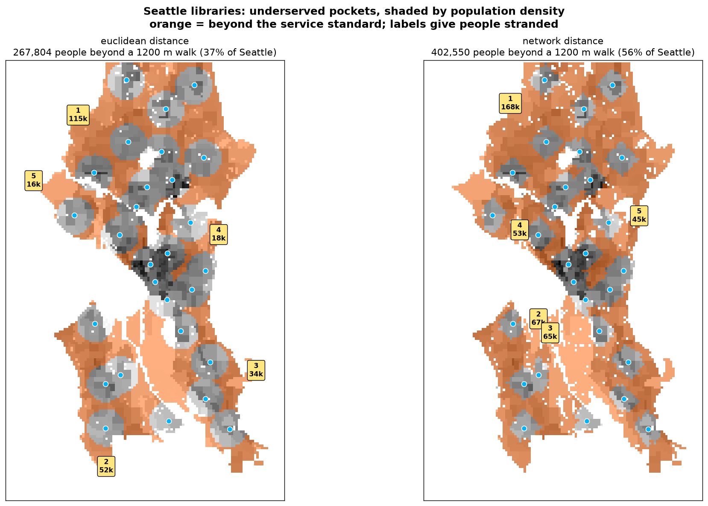

# Civic Coverage Lab

Do persistent-homology coverage models change materially when you swap Euclidean distance
for real walk-network distance — and does it matter once you weight by who actually lives
there?

Case study: Seattle public libraries (28 branches).

## Phase 1 — the geometric gate

**Question:** if the holes barely move under a network metric, the thesis is dead and
there is nothing to build.

**Verdict: passes emphatically.** The two metrics do not merely relocate holes — they
disagree about whether holes exist at all.

| | Euclidean | Walk network |
|---|---:|---:|
| H1 holes (persistence ≥ 300 m) | 3 | **32** |
| Most persistent hole | 1,053 m | **8,081 m** |
| Total persistence | 1,778 m | **50,988 m** |
| Bottleneck distance between diagrams | | **4,041 m** |


### Confounds ruled out

**Just a rescaling?** No. Scaling the Euclidean field by the observed mean detour ratio
(1.47) gives 5 holes / 3,346 m. The network gives 32 / 50,988 m — 15× more.

**Just the noise threshold?** No — the gap *widens* as it rises. At every threshold
≥ 2,000 m the Euclidean field has **zero** holes while the network still has 8.

| min persistence | 300 m | 500 m | 1 km | 2 km | 3 km | 5 km |
|---|---:|---:|---:|---:|---:|---:|
| Euclidean | 3 | 1 | 1 | 0 | 0 | 0 |
| Network | 32 | 24 | 19 | 8 | 2 | 1 |

## Phase 2 — demand weighting

Persistence measures the geometric size of a hole, not whether anyone is stranded in it.
Unweighted, the top holes were an industrial strip and a floating bridge. Adding ACS
population, poverty, and car-free-household layers plus TIGER water masking fixes that.

At a 1,200 m service standard (~15 min walk):

| | Euclidean | Walk network |
|---|---:|---:|
| People beyond the standard | 267,804 (37.1%) | **402,550 (55.8%)** |
| Underserved pockets | 29 | 42 |

**The metric change moves 134,746 people — half of Seattle's population again — from
"served" to "underserved."** That is the finding with a policy consequence attached.



Top pockets under the network metric, anchored at their worst-served point:

| # | Anchor | People | Worst walk | Car-free HH |
|---|---|---:|---:|---:|
| 1 | Broadview | 167,979 | 4,603 m | 7,049 |
| 2 | West Seattle | 66,847 | 5,116 m | 2,231 |
| 3 | Delridge | 64,994 | **10,592 m** | 3,004 |
| 4 | Queen Anne | 53,340 | 4,731 m | 6,253 |
| 5 | Madison Park | 44,528 | 3,777 m | 4,549 |

Ranking by car-free households rather than population reorders this list — Queen Anne
rises from 4th to 2nd. For a *walking* accessibility question that is arguably the better
demand variable, and it is not a cosmetic difference.

### Sensitivity to the service standard

| standard | 600 m | 800 m | 1 km | 1.2 km | 1.6 km | 2 km |
|---|---:|---:|---:|---:|---:|---:|
| pockets | 12 | 17 | 33 | 42 | 54 | 76 |
| people underserved | 627,255 | 554,279 | 479,551 | 402,550 | 248,561 | 134,686 |

## Phase 3 — does topology beat MCLP? No.

Two negative results, and they point the same way.

### The enclosed/edge distinction carries no information

PH labels each pocket as topologically *enclosed* by coverage or merely hanging off the
city edge. That sounds valuable. Here it is not:

- enclosed pockets: 9.11 – 55.37 km²
- unenclosed pockets: 0.04 – 0.70 km²

**No overlap.** "Enclosed" is perfectly predicted by pocket size — so a distance buffer
plus connected-component labelling gives you the same partition for a fraction of the
compute.

### The siting benchmark

The decision: *where should Seattle put the next 8 branches?* All strategies pick from the
same 1,020-site candidate grid (450 m spacing), snapped by **network** distance, and are
scored identically. `worst-point` is the control — place at the worst-served inhabited
cell, recompute, repeat, no topology anywhere.

People brought within the 1,200 m standard by 8 new branches:

| strategy | newly covered | % of best |
|---|---:|---:|
| **MCLP greedy** | **+96,329** | 100% |
| random (mean of 5) | +34,033 | 35% |
| PH by population (adaptive) | +18,502 | 19% |
| PH by persistence | +13,381 | 14% |
| PH by population | +11,278 | 12% |
| worst-point (no topology) | +2,479 | 3% |

**Every PH variant loses to random placement.** The mechanism is not subtle: persistence
points at the *most remote* location, and the most remote location is by definition where
the fewest people live. Maximising distance is close to the opposite of maximising
coverage.

### Testing PH on an objective it should suit

Scoring only on population covered is rigged — that is MCLP's own loss function. Coverage
is max-sum and rewards density; worst-case walk distance is minimax and rewards reaching
the isolated, which is what a hole detector points at. So PH should win there.

It does not:

| strategy | covered | car-free HH | worst walk | p95 walk |
|---|---:|---:|---:|---:|
| MCLP greedy | **+96,329** | **+8,632** | +0 m | −95 m |
| worst-point (no topology) | +2,479 | +266 | **−6,001 m** | −115 m |
| PH by persistence | +13,381 | +336 | −3,402 m | −254 m |
| PH by population (adaptive) | +18,502 | +764 | +0 m | **−374 m** |
| random (mean of 5) | +34,033 | +2,123 | +0 m | −173 m |

PH wins exactly one column — population-weighted p95 walk — by a modest margin. On the
minimax objective it was supposed to own, the trivial no-topology rule beats it by
**1.8×**, which stands to reason: if the objective is to shrink the largest distance,
placing at the largest-distance point is nearly optimal by construction.

**For every objective tested there is a simpler tool that beats persistent homology.**

### What this does not show

The literature's claim for PH is detection, not siting: a barcode describes coverage
across *all* scales at once, where MCLP and worst-point both need a service standard `S`
and a budget `k` chosen up front. This benchmark holds `S` and `k` fixed, so it cannot
speak to that. But for "tell me where the next branch goes," topology is the wrong engine.

Notably MCLP does not improve worst-case walk *at all* (+0 m). MCLP and worst-point are
complementary, and neither one needs topology.

## Method

Sublevel-set persistent homology of the nearest-facility distance field, 150 m grid.

The sublevel set `{x : d(x) ≤ t}` of a *Euclidean* nearest-facility field is exactly the
union of radius-`t` balls around the facilities, so its H1 is the Čech coverage picture
from the literature. Substituting network distance gives the same construction under a
travel-time metric. Identical machinery both ways, so any difference in the barcode is
attributable to the metric, not the pipeline.

Network distances come from one multi-source Dijkstra over the OSM walk graph seeded at
every facility node — nearest-facility distance for all nodes in a single pass.

Holes are localised at the **death** cell. The birth cell is the saddle where the loop
closes and sits on the void's rim; the death cell is the last point the sublevel set
reaches — the most underserved point, and where you would site a facility. Verified
against a synthetic ring (8 points, radius 30): death value 30.0, death cell exactly the
centre.

## Three traps this hit

**`retain_all=False` silently deleted a quarter of Seattle.** `osmnx.graph_from_polygon`
defaults to keeping only the largest connected component, and Seattle's walk network is
not connected — West Seattle attaches only via bridges whose pedestrian ways are not
continuously tagged. Five library branches vanished. Fixing it moved the analysed area
from 194 km² to 226 km² (Seattle land ≈ 217 km²) and strengthened the headline result.

**The Census API returns 200 OK with all-null values for the wrong geography.** B17001
(poverty) and B08201 (no vehicle) are not published at block-group level. The request
succeeds and returns the right row count, entirely full of nulls — so a status-code check
passes and the data is silently zero. Those two now fall back to tract resolution, and
`fetch_acs` raises if a column comes back all-null.

**Snapping a recommendation by grid-index distance silently breaks the siting loop.**
All strategies must place on a shared candidate grid, and the obvious snap is nearest
cell in raster coordinates — but across a canal that neighbour is kilometres away on
foot. The placed facility then fails to cover the point it was meant to serve, the same
cell stays worst-served, and the strategy re-picks it forever (the control collapsed to
2 distinct sites out of 8). Snapping now uses network distance and forbids repeats.

**The obvious definition of a hole's extent swallows the city.** The void a class encloses
is the component of `{d > birth}` containing the death cell — but at low birth values that
superlevel set is still globally connected, so one hole's "region" measured 167 km² and
616,000 people. Pockets are instead cut at a policy service standard, with PH used for
what it uniquely offers (enclosed vs. edge), not for extent.

## Known limitations

- **Distance, not time.** Metres along the walk graph, no slope penalty. Seattle's hills
  are a real cost this does not price.
- **Coarse demand geography.** Poverty and car-free households are tract-level, so they
  smear across the block-group population raster.
- **Seattle flatters the thesis.** Near-best case — water everywhere, few bridges. A
  gridded city (Phoenix) would show far less separation. Testing one is the honest next
  step.
- Permanently-unfillable voids register as essential classes and are excluded from the
  finite bars, so hole counts are conservative.
- The siting benchmark fixes `S`=1200 m and `k`=8 and uses greedy (not exact) MCLP.
  Greedy is (1-1/e)-optimal for max-coverage, so an exact solve would only widen its
  already decisive margin.

## Validation checks

- Rasterised population: **752,498** vs Seattle's actual ≈755,000 (0.3% error).
- Poverty rate 9.6%, car-free households 65,317 — both plausible for Seattle.
- Synthetic-ring test for the persistence localisation (above).

## Running it

```bash
uv run python src/ccl/fetch.py               # Seattle City GIS facility layers
uv run python src/ccl/fields.py libraries    # both distance fields (~1 min)
uv run python src/ccl/demand.py              # ACS + TIGER water rasters
uv run python src/ccl/persistence.py libraries
PYTHONPATH=src uv run python -m ccl.rank libraries
PYTHONPATH=src uv run python -m ccl.viz libraries
PYTHONPATH=src uv run python -m ccl.viz_demand libraries
PYTHONPATH=src uv run python -m ccl.mclp libraries        # siting benchmark
PYTHONPATH=src uv run python -m ccl.objectives libraries  # multi-objective comparison
```

Needs `CENSUS_DATA_API_KEY` in `.env` ([free signup](https://api.census.gov/data/key_signup.html)).

Data: facility points from Seattle City GIS ArcGIS services; walk network from OSM via
OSMnx; boundary via Nominatim; population/poverty/vehicle from Census ACS5 2023; water
from TIGER 2023.
