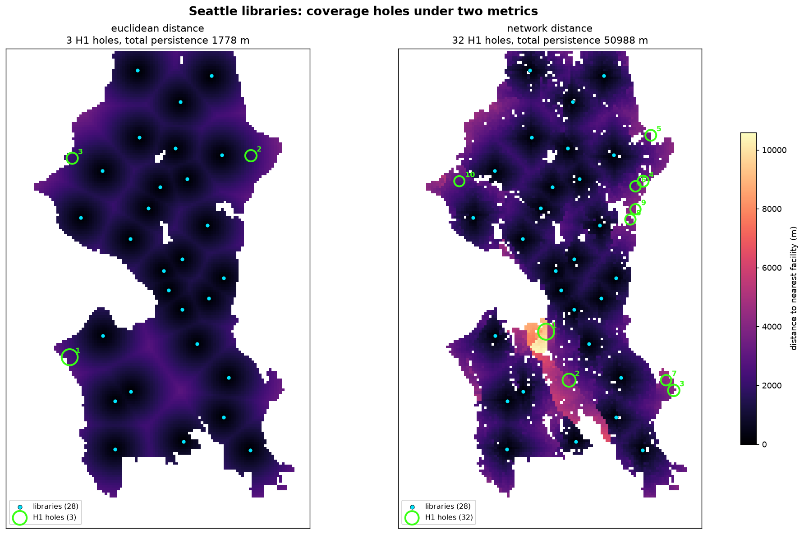

# Civic Coverage Lab — spike

**Question the spike had to answer:** does swapping Euclidean distance for walk-network
distance actually change which coverage holes persistent homology finds? If the holes
barely move, the project thesis is dead and there is nothing to build.

**Verdict: the gate passes, emphatically.** On Seattle public libraries, the two metrics
do not merely relocate holes — they disagree about whether holes exist at all.

## Result

| | Euclidean | Walk network |
|---|---:|---:|
| H1 holes (persistence ≥ 300 m) | 3 | **32** |
| Most persistent hole | 1,053 m | **8,081 m** |
| Total persistence | 1,778 m | **50,988 m** |
| Bottleneck distance between the two H1 diagrams | | **4,041 m** |



## Method

Sublevel-set persistent homology of the nearest-facility distance field, on a 150 m grid.

The sublevel set `{x : d(x) ≤ t}` of a *Euclidean* nearest-facility field is exactly the
union of radius-`t` balls around the facilities, so its H1 is the Čech coverage picture
from the literature. Substituting network distance gives the same construction under a
travel-time metric. Identical machinery both ways, so any difference in the barcode is
attributable to the metric and not to the pipeline.

Network distances come from one multi-source Dijkstra over the OSM walk graph seeded at
every facility node, which yields nearest-facility distance for all ~700k nodes in a
single pass.

Holes are localised at the **death** cell, not the birth cell. The birth cell is the
saddle where the loop closes and sits on the rim of the void; the death cell is the last
point the sublevel set reaches — the most underserved point, and where you would site a
new facility. Verified against a synthetic ring (8 points on a radius-30 circle): death
value 30.0, death cell exactly the circle centre.

## Confounds ruled out

**Is it just that network distances are bigger?** No. Scaling the Euclidean field by the
observed mean ratio (1.47) gives 5 holes / 3,346 m total. The network gives 32 holes /
50,988 m — 15× more, so the effect is structural rather than a rescaling artifact.

**Is it the noise threshold?** No — the gap widens as the threshold rises. At every
threshold ≥ 2,000 m the Euclidean field has **zero** holes while the network still has 8.

| min persistence | 300 m | 500 m | 1 km | 2 km | 3 km | 5 km |
|---|---:|---:|---:|---:|---:|---:|
| Euclidean | 3 | 1 | 1 | 0 | 0 | 0 |
| Network | 32 | 24 | 19 | 8 | 2 | 1 |

## Where the holes are

Reverse-geocoded, the top network holes are peninsulas, bridge-constrained areas, and
barrier-cut industrial land — precisely where Euclidean distance lies:

1. 8,081 m — East Marginal Way / Duwamish (industrial)
2. 4,546 m — Georgetown (industrial)
3. 2,989 m — I-90 corridor *(bridge artifact, see below)*
4. 2,582 m — Laurelhurst (residential peninsula)
5. 2,391 m — View Ridge / Sand Point (residential)
6. 2,111 m — Laurelhurst (residential)
8. 2,026 m — SR-520 floating bridge *(bridge artifact)*

Of the top 8: three are genuine residential holes, two are real but low-population
industrial land, and three are bridge artifacts.

## Known limitations

- **Bridge artifacts.** The I-90 and SR-520 floating bridges carry pedestrian paths, so
  bridge deck cells survive the "near the walk network" mask and register as underserved.
  Nobody lives on a bridge. Needs a residential land-use mask.
- **No demand weighting.** The Duwamish holes are real but nearly unpopulated. The Census
  API now requires a key, so population is deferred to phase 2 — which is also the fix for
  the bridge artifacts.
- **Distance, not time.** Metres along the walk graph, with no slope penalty. Seattle's
  hills are a real cost that this does not yet price.
- **One branch still masked** (Broadview), and scattered cells >250 m from any walk edge
  are excluded. Permanently-unfillable voids register as essential classes and are
  excluded from the finite bars, so the counts above are conservative.
- **Seattle flatters the thesis.** It is a near-best case — water everywhere, few bridges.
  A gridded city (Phoenix) would show far less separation. Testing one is the honest
  next step.

## Gotcha worth keeping

`osmnx.graph_from_polygon(..., retain_all=False)` keeps only the largest connected
component. Seattle's walk network is *not* connected — West Seattle attaches only via
bridges whose pedestrian ways are not continuously tagged — so the default silently
deleted a quarter of the city, including five library branches. Fixing it moved the
analysed area from 194 km² to 226 km² (Seattle land area is ~217 km²) and made the
headline result substantially stronger.

## Running it

```bash
uv run python src/ccl/fetch.py              # Seattle City GIS facility layers
uv run python src/ccl/fields.py libraries   # build both distance fields (~1 min)
uv run python src/ccl/persistence.py libraries
PYTHONPATH=src uv run python -m ccl.viz libraries
```

Data sources: facility points from Seattle City GIS ArcGIS services, walk network from
OSM via OSMnx, city boundary via Nominatim.
